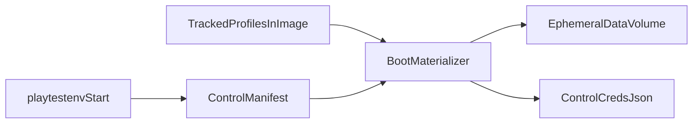

# Synthetic Playtest Profiles — Design

**Chunk:** 0.3b (Adversarial Review Remediation Roadmap)  
**Status:** Revised after adversarial review 2026-08-08 (awaiting plan)  
**Depends on:** 0.3a (ephemeral playtest supervisor)  
**Feeds:** 0.3c (single-agent ephemeral playtests)

## Goal

Ship six tracked, sanitized synthetic player **templates**, a per-run
**manifest** (profile + validated start room + overlays), and an in-engine
**boot materializer** that creates run-scoped offline AI users with
per-run credentials before listeners start.

This chunk ends when an ephemeral playtestenv start can request explicit
profiles, the server reaches `Server Ready` only if materialization
succeeded, and `creds.json` is available on the host for later 0.3c login.
It does **not** bind goals to profiles or run mudagent.

## Non-goals

Owned by **0.3c** or later — not this design:

- Automatic goal→profile selection or “pick the right kit for this goals file”
- mudagent loop, gameplay reports, wall-clock session budgets
- LLM/API error handling
- Production or remote targeting
- Reading `_archive/prod-users` (or any archive) at runtime
- Changing production `compose.yml` or ordinary non-playtest boots’ behavior
  when `Playtest.ProfilesManifest` is empty
- Exporting materialized users back into authored source trees

Roadmap wording that “goals can reference” profiles means 0.3b **defines the
stable profile IDs and materialization contract** those goals will later name.
Wiring goals → profile requests is 0.3c.

## Decisions

| Topic | Choice |
|-------|--------|
| Approach | Server boot materializer (not supervisor-prewritten user YAML) |
| Run selection | Per-run manifest in playtestenv `control/` |
| Credentials | Per-run generated username + bcrypt password; plaintext only in `creds.json` |
| Ladder | `fresh`, `early`, `mid`, `veteran` (Meirok **design reference**), `specialist-caster`, `admin` |
| `fresh` | Naked post-creation character at a validated newbie/Sanctum start room |
| Creation-flow tests | Empty/absent manifest (no synthetic users); agent uses create-character |
| Template path | `tools/playtest/profiles/` + runner image `COPY` to `/app/playtest/profiles` |
| Persist path | Offline persist only — **must not** call `users.CreateUser` |

**Why not `CreateUser`:** it overwrites `Role` to `user` and registers the
record in online connection maps (`Users` / `Connections`), which is wrong for
offline AI seeds and breaks the `admin` template.

## Architecture



Templates live **outside** the writable `data:/app/_datafiles` volume (e.g.
`/app/playtest/profiles`). Materialized users are written under
`DataFiles/users/` on that disposable volume and are discarded with the run.

### Tracked templates

- Path (repo): `tools/playtest/profiles/<id>.yaml`
- Path (container): `/app/playtest/profiles/<id>.yaml`
- Exact IDs: `fresh`, `early`, `mid`, `veteran`, `specialist-caster`, `admin`
- Allowed gameplay fields: role, placeholder username (ignored at materialize),
  character name/description/species, stats, skills, spellbook, quest
  tokens/flags, inventory, equipment, gold/bank (capped in authoring), room
  hint (overridden by manifest `start_room`)
- Forbidden in templates (sanitizer fail): nonempty `password`, any `inbox`,
  `emailaddress`, real prod account names as `username`/`character.name`,
  identity-bearing macros/aliases/ticks/triggers, discord/IP-like fields if
  present
- `veteran`: authored by human/agent from a Meirok-class archive **offline**;
  the load path never opens `_archive/`
- `fresh`: no equipment, no inventory items, no spells/skills beyond engine
  defaults; start room supplied by manifest (validated)
- `admin`: `role: admin` only on this ID; all other IDs must be `user`

### Run manifest (ephemeral)

playtestenv writes `control/profiles-manifest.yaml` (bound at `/run/dogmud/`):

```yaml
entries:
  - profile: veteran
    start_room: 462
    overlays:
      grant_spells: { "new-spell-id": 1 }
      grant_skills: { "salvage": 10 }
      grant_items: [30036]
      equip: { weapon: 1001 }
      set_quest_tokens: ["10-start"]
      set_quest_flags: { "11-branch": "rhett" }
      set_gold: 500
```

Rules:

- Missing config key / empty `ProfilesManifest` string → materializer **no-op**
  (production-safe).
- Present path with `entries: []` → success no-op (creation-flow).
- Present path that cannot be read/parsed → **fail boot** (exit before listeners).
- Unknown YAML keys on the manifest or `overlays` object → **fail boot**.
- Duplicate `profile` IDs in one manifest are allowed (separate users/creds).
- Template placeholder `username` is always replaced by a generated username.

### Overlay semantics (exact)

| Field | Semantics |
|-------|-----------|
| `grant_spells` | Set spell id → rank (overwrite if present). Rank ≥ 1. Spell must exist in loaded spell registry. |
| `grant_skills` | Set skill name → rank (overwrite). Rank ≥ 1. |
| `grant_items` | Append new item instances to inventory (each id must exist). |
| `equip` | Set named equipment slot → new item instance (slot key = Worn yaml key, e.g. `weapon`). Replace any prior item in that slot. |
| `set_quest_tokens` | Grant via character quest API; fail if token cannot be applied. |
| `set_quest_flags` | Set flag key → value. |
| `set_gold` | Replace character gold with non-negative int. |

No free-form deep merge of arbitrary `UserRecord` / `Character` fields.
`start_room` always replaces `character.roomid` and must exist in the loaded
room registry after `loadAllDataFiles`.

### Config gate

```yaml
Playtest:
  ProfilesDir: tools/playtest/profiles      # container override: /app/playtest/profiles
  ProfilesManifest: ""                      # override: /run/dogmud/profiles-manifest.yaml
```

playtestenv sets both overrides for ephemeral runs that request profiles.
Ordinary boots leave `ProfilesManifest` empty.

### Materializer

**When:** normal boot only (`!copyover`), after user-index create/rebuild, after
`loadAllDataFiles` (so rooms/items/spells/quests exist), before plugins and
listeners.

Version `migration.Run` already completed earlier in boot; user-format
migrations run as part of index setup when needed. Materialization must not
run on copyover restore.

**Per entry (fail closed):**

1. Load template by id from `ProfilesDir` + sanitize  
2. Apply overlays + `start_room`  
3. Generate username (`pt_<profile>_<suffix>`, underscores — hyphens fail
   `Validation.NameRejectRegex`) passing `ValidateName`; retry on collision
   (bounded); fail if exhausted  
4. Generate password within Validation password length bounds; `SetPassword`
   (bcrypt)  
5. Set `IsAI=true`; preserve template `role`  
6. Offline persist: assign `UserId` via `GetUniqueUserId`,
   `Character.SetUserId`, `SaveUser`, update user index (`Create` if missing,
   else `AddUser`) — **never** `CreateUser`  
7. Run `Character.Validate` (and any required quest-flag declaration checks
   that would panic later); fail boot on error  

**All-or-nothing for the run:** if any entry fails after earlier entries were
persisted, boot still exits non-zero before listeners. The disposable volume
may contain partial users; that is acceptable because the volume is not reused
and playtestenv cleanup removes it. Do not attempt multi-entry transactions
across files.

**Credentials artifact:** write `/run/dogmud/creds.json` (control bind) with
mode `0600` after all entries succeed:

```json
{
  "players": [
    {
      "profile": "veteran",
      "username": "pt_veteran_a1b2c3",
      "password": "...",
      "user_id": 1,
      "room_id": 462
    }
  ]
}
```

If creds write fails after persist → fail boot (fail closed).  
Boot logs: materialized **count** only. Never passwords, never full creds JSON
in logs or environment-failed Markdown reports (paths only).

### Image packaging

The runner stage today copies only the binary and `_datafiles`. 0.3b **must**
add:

```dockerfile
COPY --from=builder /src/tools/playtest/profiles /app/playtest/profiles
```

`Dockerfile.dockerignore` already excludes `tools/playtest/targets.yaml` and
`.run*` / reports; it must **not** exclude `tools/playtest/profiles/**`.

### playtestenv wiring (0.3b)

- Extend `StartOptions` with an explicit `Profiles` list (profile id, start
  room, overlays). No goal file parsing.
- When the list is non-empty: write `profiles-manifest.yaml`, set Playtest
  overrides, after ready surface `Artifacts.Creds` pointing at the host path
  for `creds.json` under the run control directory.
- When the list is empty/omitted: do not set `ProfilesManifest` (creation-flow).
- Preserve 0.3a local-only Docker / loopback AI endpoint rules.
- Failure to materialize → container exits before `Server Ready` → existing
  0.3a readiness/failure evidence path (build/server logs, environment-failed
  report without secrets).

## Failure modes (0.3b)

| Failure | Behavior |
|---------|----------|
| Unreadable/invalid manifest; unknown profile; bad room; bad overlay ref; sanitize/Validate fail; username allocation fail | Process exits before listeners; playtestenv records environment failure |
| Creds write fail after persist | Exit before listeners (fail closed) |
| playtestenv cannot write/mount control files | Start fails; 0.3a cleanup |
| Empty/absent manifest path or `entries: []` | Success; zero synthetic users |

Agent/API/token failures are **out of scope**. Handoff: ready + creds path, or
not-ready with environment failure category.

## Sanitization contract

Authoring + CI gate on every committed template:

- No nonempty password; no inbox; no email  
- No prod account usernames/character names  
- No macros/aliases/ticks/triggers that embed personal identity  
- Fictional description/name only  
- Inventory/equipment/spell/skill/quest refs must exist under loaded world data
  in the validation test  
- Assert load path never contains `_archive` / `prod-users`

## Testing

- Unit: manifest KnownFields reject; overlay semantics; sanitizer; credential
  shape; config no-op; offline persist does not call `CreateUser` / preserves
  admin role  
- Docker integration (opt-in): `fresh` → ready + creds + AI login at start
  room; veteran + spell overlay; bad `start_room` fails boot; empty profiles
  OK; production runner smoke unaffected (no manifest)  
- Package/CI: all six templates sanitize + Validate against real data files  

## Handoff to 0.3c

0.3c consumes: loopback AI endpoint, `creds.json`, and (later) goal-derived
`Profiles` lists. 0.3c owns mudagent, wall-clock budgets, and incomplete
reports (wall-clock expiry or soft token/API driver stops). Chunk 1.5
(remove tracked playtest credentials) remains
separate; run-local `creds.json` under gitignored `.run/` must never be
committed.

## Adversarial review notes (2026-08-08)

Addressed in this revision:

- Scope language no longer claims goals are wired in 0.3b  
- Exact overlay / fail-closed / all-or-nothing-volume semantics  
- Creds file mode, schema, and ban from failure reports  
- Explicit `CreateUser` prohibition with rationale  
- Runner image COPY + dockerignore constraint  
- Boot ordering relative to index, copyover, and listeners  
- Distinction between empty path, empty entries, and invalid manifest  
- Template username ignored; generated names only  
